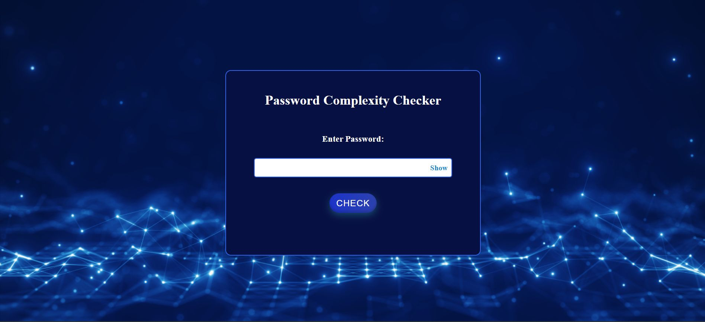

# Password Complexity Checker
This is a simple web application that allows users to check the strength of their passwords based on predefined complexity rules. It uses HTML, CSS, and JavaScript to provide an interactive experience, ensuring that users create strong and secure passwords.

## 📸 Screenshot

Here’s what the Password Complexity Checker looks like:



## Features
- **Password Strength Indicator**: A dynamic strength meter that shows how strong a password is based on length, uppercase, lowercase, numeric, and special character requirements.
- **Real-time Feedback**: Instant validation as the user types their password.
- **Responsive Design**: Works well on both desktop and mobile devices.

## Technology Stack
- **HTML**: Structure and layout of the password checker.
- **CSS**: Styling and layout adjustments for a clean, user-friendly interface.
- **JavaScript**: Logic for password validation and feedback display.

## Getting Started
To use the Password Complexity Checker locally, follow these steps:

### Prerequisites
Ensure that you have a web browser installed (Google Chrome, Mozilla Firefox, etc.).

### Installation
1. **Download or clone the repository**:
 ```bash
   git clone https://github.com/Rushi19-04/Password_Complexity_Checker.git
 ```

2. **Navigate to the project directory**:
 ```bash
  cd Password_complexity_checker
 ```


3. **Open `index.html` in a web browser**:
   - **For Mac**:
   ```bash    
     open index.html
   ```   
   - **For Windows**:
     - **Graphical Method**: Double-click on the `index.html` file in File Explorer to open it in your default browser.
     - **Command Line Method**: Open Command Prompt and run the following command:
    ```bash
       start index.html
    ```     
   - **For Linux**:
    ```bash
     xdg-open index.html
    ```  

### Usage
1. Open the project in a browser.
2. Enter a password in the input field.
3. The strength of the password will be displayed as a meter, along with real-time feedback about the password’s complexity.

### Password Complexity Rules
The password strength is evaluated based on the following criteria:
- Minimum 8 characters
- At least one uppercase letter
- At least one lowercase letter
- At least one number
- At least one special character (e.g., !, @, #, $, etc.)

## Contributing
If you'd like to contribute to the development of this project, feel free to fork the repository, make your changes, and create a pull request.

## License
## License
This project is licensed under the [MIT License](License).

